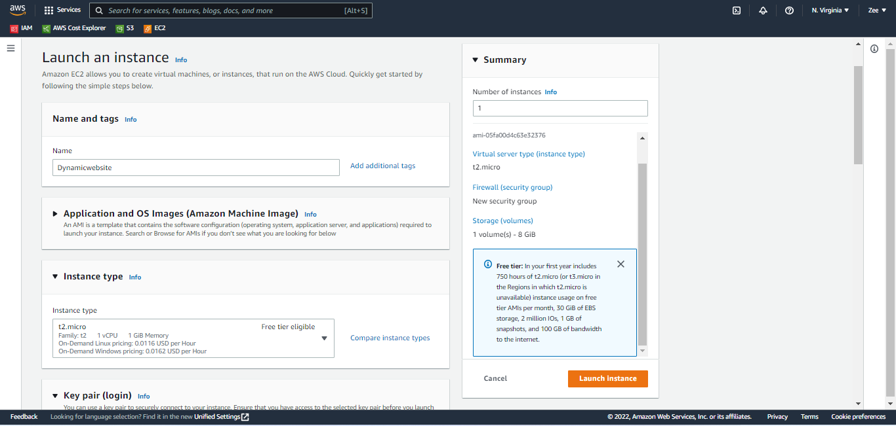
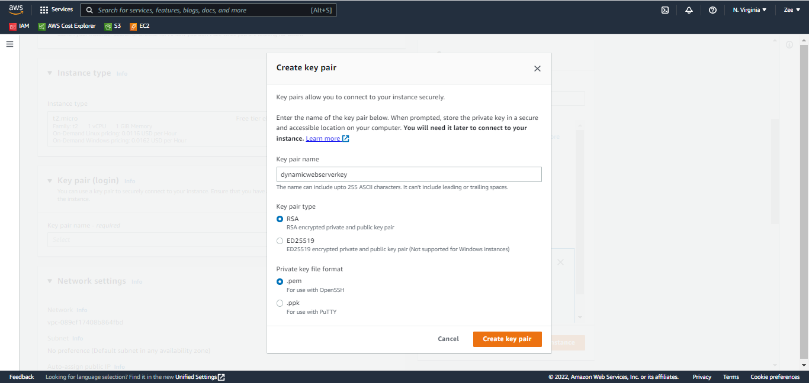

# using S3 service to store developer codes before hosting them on virtual servers (EC2) for dynamic web apps.
    Follow steps from hosting a static website to create a bucket on S3. Do not uncheck the make public box
    Upload the dynamic website files  (source code and all). Do not forget to enable bucket versioning and server-side encryption. Do not enable static webhosting feature as we are only storing our code in here

### Remember role is a way services communicate in AWS
    Create a role and assign it AmazonS3fullaccess policy

    Now search and select EC2 from the search bar
    click on launch instances and create an instance

### Configure instance details
    Leave VPC to default
    Subnet:choose an availability zone 
    Auto assign IP: enable

    Proceed to create a new key pair, this will enable you access into the macihne using port 22

### Configure firewall rules:
    Create a new security group
    click "Add security group rule" to add the below rules
    select ssh, source myip

    HTTP and HTTPS, source ANYWHERE

    Proceed to lunch instance

### Add role to instance
    Select the instance created, click on "actions"
    Locate security, modify IAM role

    In the textbox, click on the drop down and select the role with S3 full access created earlier then click update.

## `connect to EC2  using MobaXterm`
    On Mobaxterm select session, 

    click on SSH enter your machine IP address as remote host, enter username (ec2-user)
    Goto advanced ssh setting. click on use private key and drop down to select the key pair downloaded earlier. select OK.

Viola, you did it...You are now connected to the launched EC2 instance

** Run the following command on your instances to Install Apacge, MariaDB,lAMP, start and enable the services and as well copy folders from our S3 to our apache **

`Commands used in Mobaxterm:`

sudo yum update -y

sudo amazon-linux-extras install -y lamp-mariadb10.2-php7.2 php7.2

sudo yum install -y httpd mariadb-server

sudo systemctl start httpd

sudo systemctl enable httpd

sudo systemctl is-enabled httpd

sudo aws s3 cp s3://dynamicwebsiteof --region us-east-1 /var/www/html/ --recursive

cd /var/www/html/: to confirm your file copied successfully*
