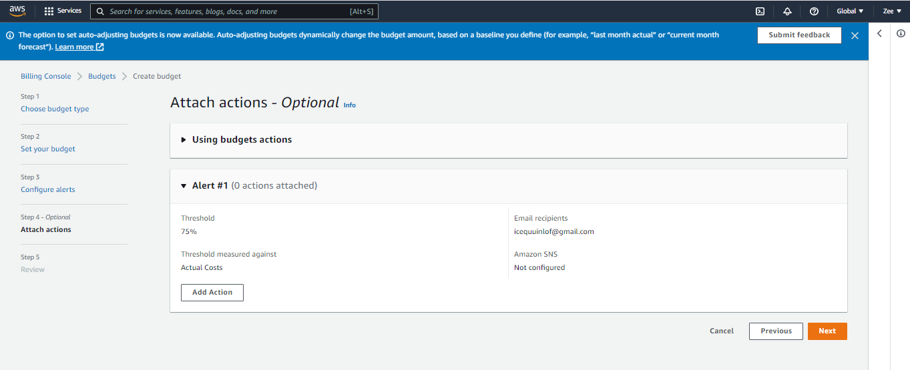

### **Using AWS Budgets to set custom budgets for tracking costs and usage of resources in an AWS account, and Setting up alerts by email when actual or forecasted cost and usage exceed budgeted threshold**

From management console search and click to open `AWS budget`

click on `create budget`. Here there are 4 major steps to follow;

> Step 1: Choose your `budget type` and click next

> Step 2: `Set your budget`. Here there are 3 fields to fill; 
    
1. Enter your budget details, fill in the "Budget name" field

2. Set budget amount (select recurring so it renew on the first day of every monthly biling period) 

3. scope of budget (Ensure ALL AWS services is selected: this will track any cost incurred from any service for your account). 

`NOTE`: click advance option and select refunds and credits in addition to the selected charge types

> Step 3 & 4: `Configure alerts and attach actions` Here you select alert threshold and specify receipient and how you want them to receive the alert. I will recommend you set email receipients only as SNS may incur extra charges.   
For threashold measured againt: Select actual or forecasted cost 

`NOTE`: You can specify up to 10 email receipients.

