# **Using AWS Identity and Access Management (IAM) to manage access to AWS services and resources securely, as well as setting up Multi-Factor Authenticator (MFA) for extra protection of the environment.**

## `Create IAM user`

IAM is a service in AWS that is used to grant permission to different AWS services.
To create an IAM user

> 1. GOTO services, search and click `IAM`

> 2. From the left pane, select `Users`. click add users

    Enter username, select access type (How user will primarily access AWS).There are 2 access types to choose from:
    Programmatic access: When configured enable users access to developers tools such as CLI, SDK AWS API etc
    AWS managemengt console access: When configured enable user access strictly via GUI

    Set Console password: It can be autogenerated or create custom password
    Require password reset: This enable user change their password on first sign in

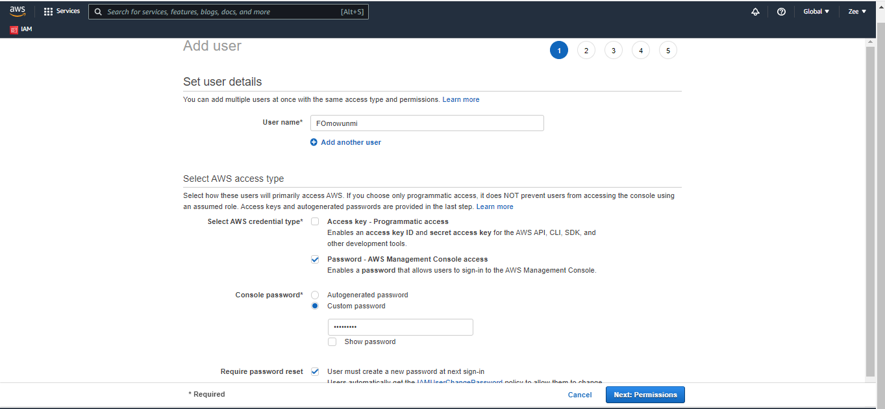

> 3. Set permissions

    Select Attach existing policy and select preferred policies as required.

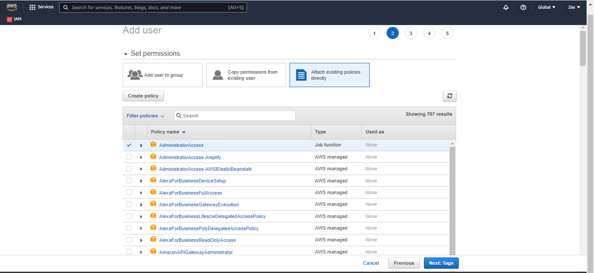

> 4. Tag: it is use for organizing (OPTIONAL) 

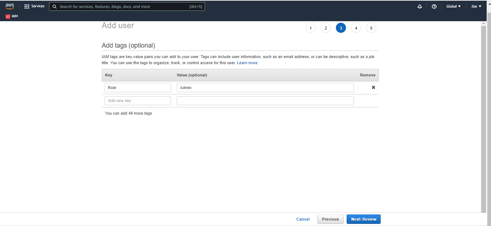

> 5. Review and create user

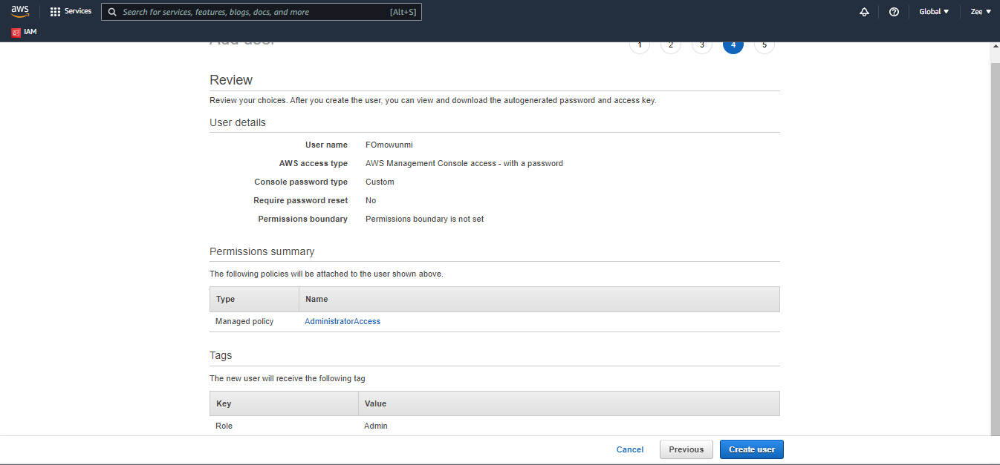

`IMPORTANT`: *Download .csv file on the next page. This file contain the unique login link of the user created*

## `IAM inline policies`

    Follow steps above to create user but do not set permissions
    Your review page should look like this

   Go back to users and click on the newly created user "Audit". 
   select the policy tab and click "Add inline policy"
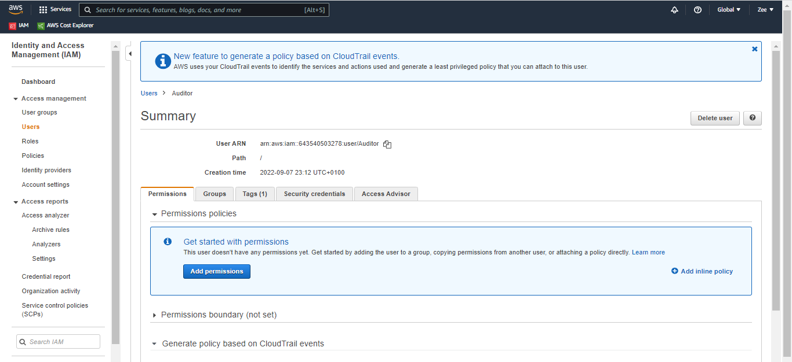

   Select Json and add your custom policy
   Note: you can search policy up on google/amazon documentry and edit
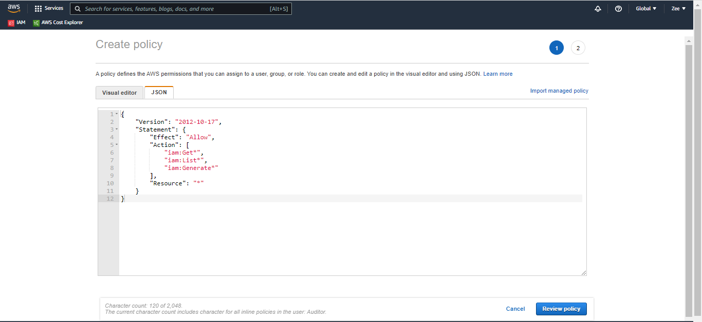

   Review and create policy
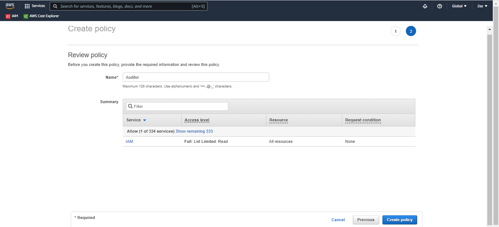

## `Create Group` 

    Select `user groups` from left pane. click create group
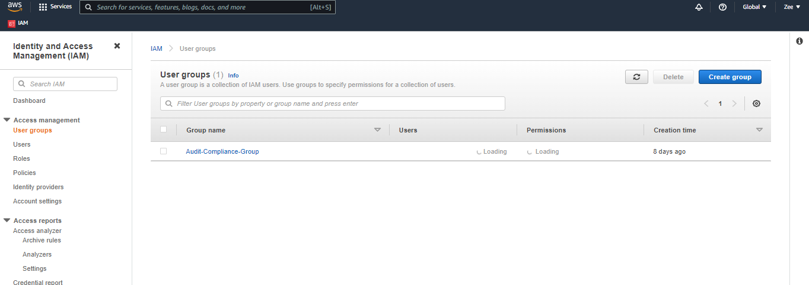

    Enter group name
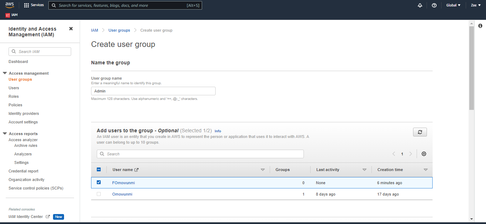

    Attach policy: This is determined by job role  
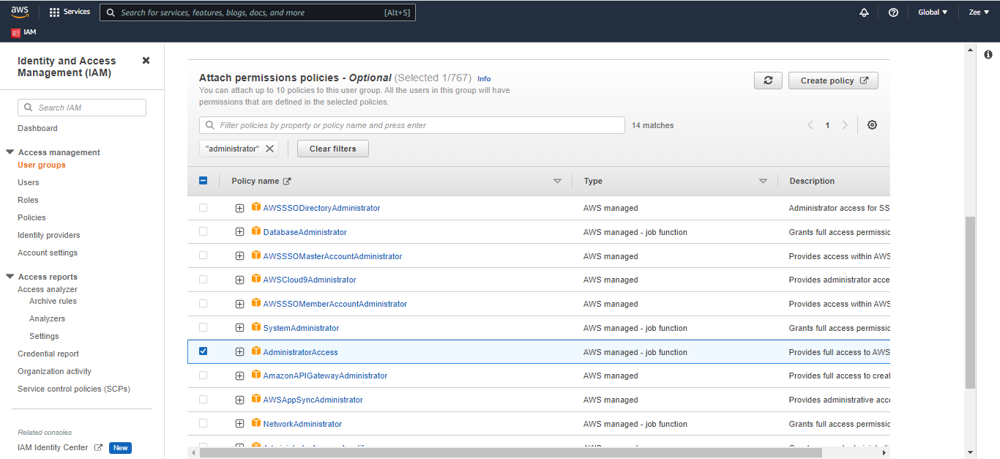

    click "create group"
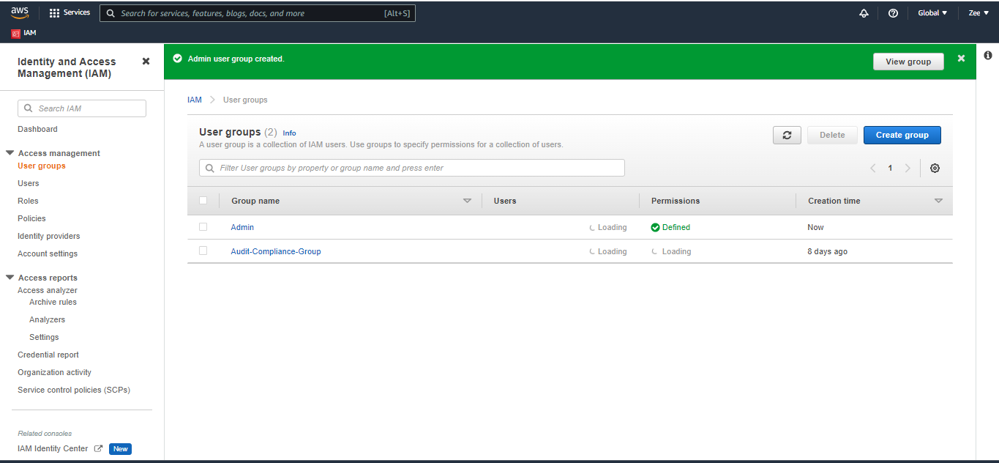

## `Add user to group`
    Click on "users" from left pane and select username to be added to group then click the "Groups" tab
    click "Add user to groups"
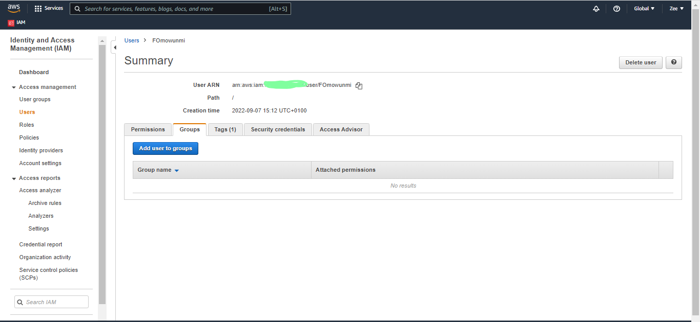

    Select group you want user to be in and click "Add to Groups" 
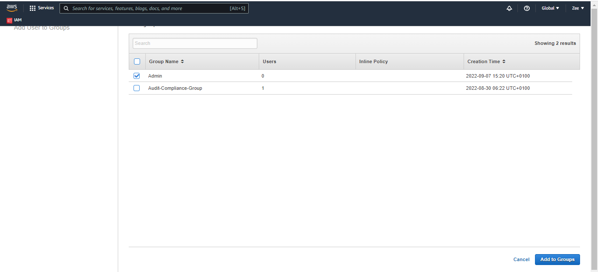

## `Assign MFA`
    From users tab click on security credentials
    Locate Assigned MFA device and click "Manage"
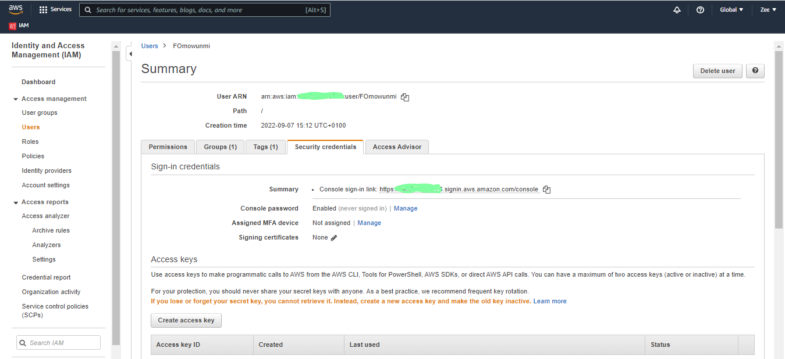

    choose "Virtual MFA device" and continue    
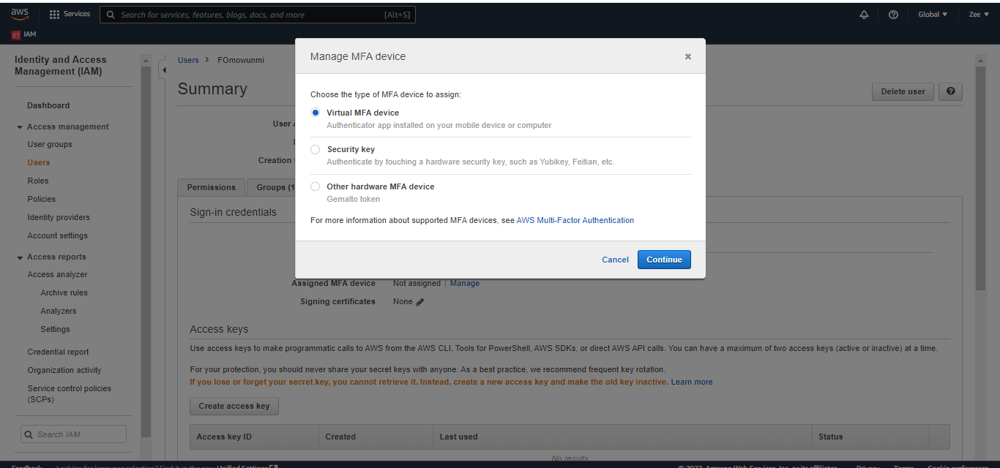

    Scan QR code using an authenticator app
    Enter 2 different codes generated by authenticator
    click assign MFA.
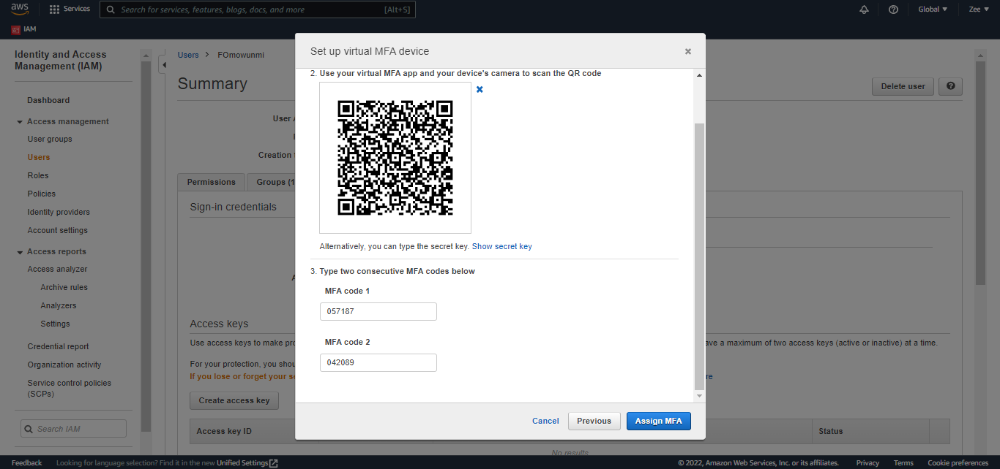

    MFA assigned successfully.
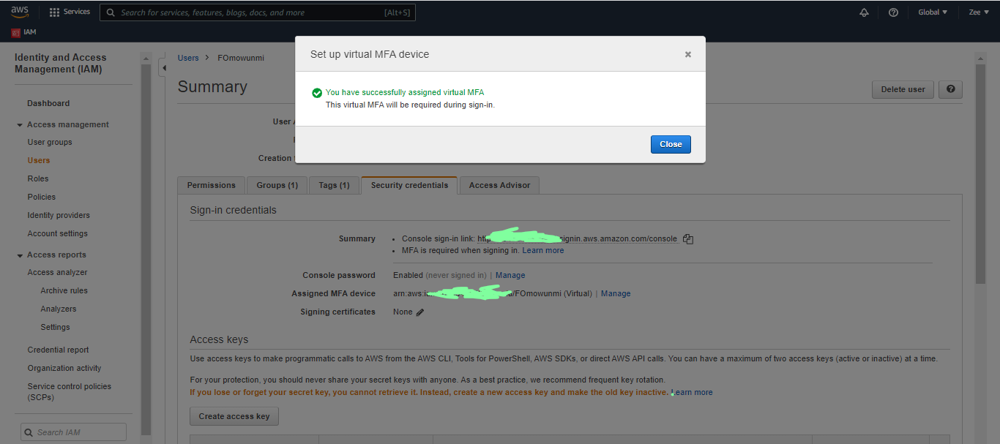

**Best practices:**

Do not logon with email

Do not log on with root user

Put users into groups, this makes it easy to assign policy to users.

**Tools to download:**
Mobaxterm and
VS code
